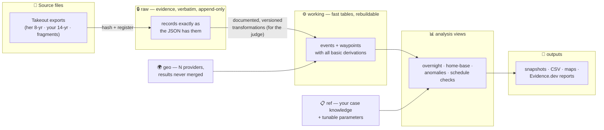
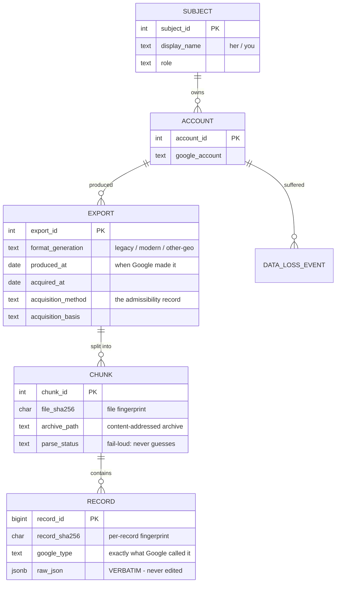
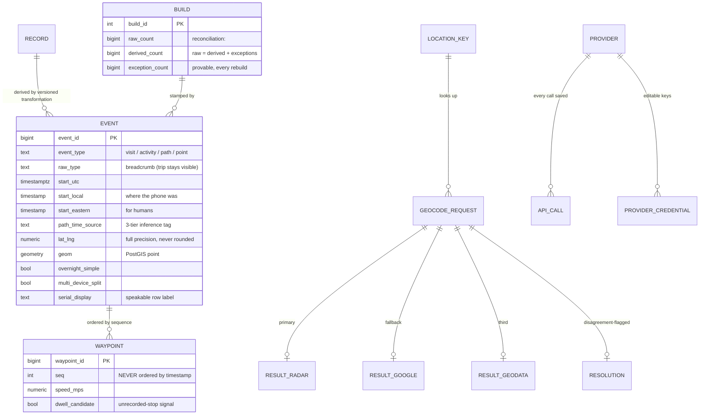

# TraceIQ Database — Live Schema

> _Naming (D-140, 2026-09-05; applied 2026-09-06): this product is **vestigia** (formerly traceIQ / TraceIQ - Latin: footprints, tracks). Working copy: `probata/modules/vestigia/` (directory rename from `modules/traceIQ/` landed 2026-09-06; old name kept as a junction). GitHub repo name unchanged pending its own decision. Canon: `probata/docs/NAMING.md`. Historical text below is left verbatim; both names remain valid in recall stores (D-142)._

> _Byline: Claude Code · Fable 5 · 2026-07-24 · **This is deployed and running** on data-pg (ovh-data), database `traceiq`, PostgreSQL 18.1 + PostGIS 3.6.4 + pg_duckdb 1.1.0. Test-loaded with 1,641 real records. First verified backup at `E:\TraceIQ_Backups\`._

## The big picture

## Evidence chain (raw schema)

## Working layer + geocoding

## What's in each namespace (32 tables live)

| Schema | Tables | Job |
|---|---|---|
| **raw** | subject, account, export, chunk, record, data_loss_event | Evidence. Verbatim, append-only, hashed. The only layer that can't be regenerated — everything else derives from it. |
| **working** | build, event, waypoint, exception | Your fast day-to-day tables. Rebuilt from raw by documented transformations; version-stamped; reconciliation counts prove nothing was dropped. |
| **geo** | provider, provider_credential, credential_audit, location_key, geocode_request, result_radar, result_google, result_geodata, resolution, snap_result, api_call, legacy_radar_cache | N-provider geocoding. Results never merged — cross-validated with disagreement flags + manual override. Every API call saved (it's evidence). Keys editable in-table, never in code. |
| **ref** | parameter, parameter_audit, home_base, expected_schedule, problematic_location, claim | Your case knowledge + every tunable (overnight window, thresholds) with audit trail. Exhibits record the parameter values they used. |
| **ops** | job, transformation, snapshot, backup | The machinery: job queue, transformation registry (judge-readable doc per transformation), snapshot registry, backup registry. |

## Seeded and verified tonight

| Item | Status |
|---|---|
| PostGIS 3.6.4 + pg_duckdb 1.1.0 coexistence (ADR-0002 test gate) | ✅ both live in `traceiq` DB |
| 6 tunable parameters seeded (overnight 22:00–07:00, multi-device 100m, speed 120mph, dwell 15min, cluster 200m, anchor ±5min — your recovered historical defaults) | ✅ |
| 6 providers seeded (radar, google, geodata enabled; osrm, valhalla, mapbox staged for road-snapping) | ✅ |
| **Test load: real corpus chunk `2024-03_2024-06.json.txt`** | ✅ 1,641 records — 626 visits, 516 activities, 498 timelinePaths, **1 `timelineMemory`** (the rare trip type — fail-loud caught it, exactly as designed) |
| First backup, hash-registered + restore-verified | ✅ `E:\TraceIQ_Backups\traceiq_2026-07-24_milestone-schema-init-testload.dump` |

Connection (tailnet): `host=100.119.96.29 port=5432 dbname=traceiq` · repo: `E:\AI_Workspace\Projects\traceiq-rebuild` (migration `db\migrations\0001_init.sql`, ADRs in `docs\adr\`)

Test data is clearly labeled (subject `TEST`) and rebuilds freely — real ingest starts with her export under proper provenance rows.
